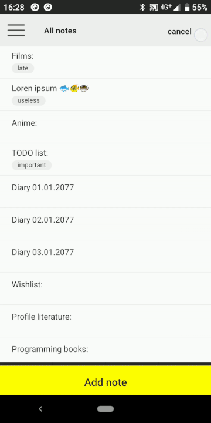

# Tag Note

Note app, where you may write notes, set categories and tags, and change and buy themes.

It`s my first OOP language project, after complete JavaRush course I decide proof my skils on real project and write my own Android app on Java.

**You may download it in Google Play:**
https://play.google.com/store/apps/details?id=com.mobile.kiril.tagnote

## Left menu and category editing

## Note editing

## Themes

## What I learned

* Java Basic & Core
* Android Basic
* OOP
* Work with SQLite database
* Android and Java debugging
* Android checkout
